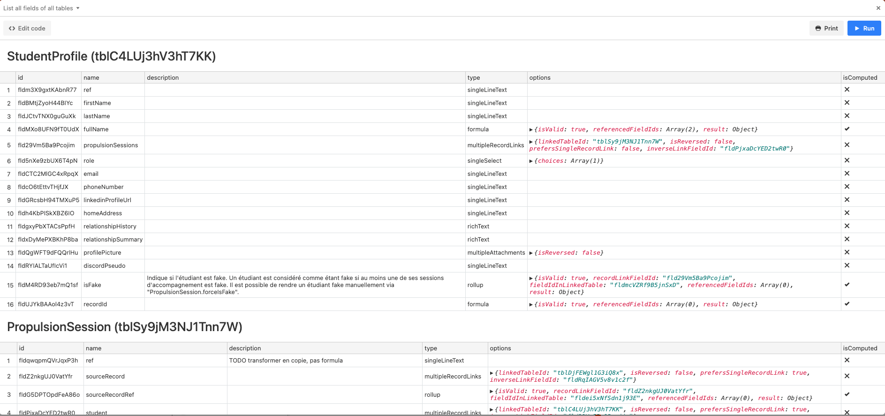

# <Scripting> List all fields of all tables

List all tables and all fields of the current base.

## Preview

## Installation

Create a new block of type [`Scripting`](https://support.airtable.com/hc/en-us/articles/360043041074-Scripting-app-overview).

Copy/paste the code in `script.js`.
